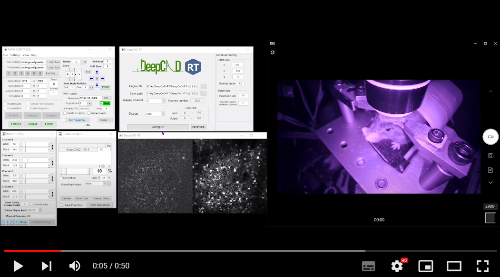

# Matlab implementation for real-time processing

To achieve real-time denoising, DeepCAD-RT was optimally deployed on GPU using TensorRT (Nvidia) for further acceleration and memory reduction. We also designed a sophisticated time schedule for multi-thread processing. Based on a two-photon microscope, real-time denoising has been achieved with our Matlab GUI of DeepCAD-RT (tested on a Windows desktop with Intel i9 CPU and 128 GB RAM).

<center></center> 

## Contents

- [Required environment](#required-environment)
- [File description](#file-description)
- [Instructions for use](#instructions-for-use)
- [Demo video](#demo-video)

## Required environment

- Windows 10
- CUDA 11.0
- CUDNN 8.0.5
- Matlab 2018a (or newer version)
- Visual Studio 2017

## File description

`deepcad_trt.m`: Matlab script that calls fast processing and tiff saving function programmed in C++

`deepcad_trt_nosave.m`: Matlab script that calls fast processing function programmed in C++ and save tiff in Matlab

`realtime_core.m`: Realtime simulation in Matlab & C++ and save tiff

`./deepcad/+deepcadSession`: Real-time inference with data flow from ScanImage

`./results`: Path to save result images

`./model`: Path for the engine file

## Instructions for use

### Install

1. Download the `.exe` file from [here](https://zenodo.org/record/6352555#.Yi82u3pBybg).
2. Copy the DLL files from <installpath>/dll to your CUDA installation directory, for example C:\Program Files\NVIDIA GPU Computing Toolkit\CUDA\vX.Y\bin, where vX.Y is your CUDA version. The CUDA installer should have already added the CUDA path to your system PATH. [TensorRT installation guide](https://docs.nvidia.com/deeplearning/tensorrt/archives/tensorrt-601/tensorrt-install-guide/index.html#installing-zip)

### Model preparation

Before using a model, you should first convert the pth model to an ONNX model, and then convert the ONNX model to an Engine file. When you change your GPU, the Engine file should be rebuilt.

   **pth model to ONNX model:**

1. Go to `DeepCAD-RT/DeepCAD_RT_pytorch/` directory and activate the `deepcadrt` environment [[Configuration tutorial for conda environment](#python-source-code)].  

   ```
   $ conda activate deepcadrt
   $ cd DeepCAD-RT/DeepCAD_RT_pytorch/
   ```

2. Run the `convert_pth_to_onnx.py`. Parameters in the following command can be modified as required.

   ```
   $ os.system('python convert_pth_to_onnx.py --patch_x 200 --patch_y 200 --patch_t 80 --denoise_model ModelForPytorch --GPU 0')
   
   @parameters
   --patch_x, --patch_y, --patch_t: patch size in three dimensions
   --GPU: specify the GPU used for file conversion
   --denoise_model: the folder containing the pre-trained models.
   ```

   The recommended patch size is 200x200x80 pixels. Put the pth model and yaml file in `./pth` path.  The default name of ONNX file name is the model file name.

   We provide a pre-trained ONNX model in `./model` . The patch size of `cal_mouse_mean_200_40_full.onnx` and `cal_mouse_mean_200_80_full.onnx` are  200x200x40 pixels and 200x200x80 pixels, respectively. The calcium imaging data used for training these model were captured by our customized two-photon microscope:

​    *Key imaging parameters of training data:*

- *30Hz sampling rate, 500x500 μm2 field of view, 490x490 pixels.*
- *The imaging depth is ranging from 40 to 180 um.*
- *The imaging power is ranging from 66 to 99 mW.*

**ONNX model to Engine file:**

3. Run the following command in Windows cmd.exe. Parameters can be modified as required: 

```
xxx\trtexec.exe --onnx=deepcad_200_80.onnx --explicitBatch --saveEngine=deepcad_fp16_200_80.engine --workspace=2000 --fp16

@parameters
--onnx: ONNX file name
--saveEngine: Engine file name
```


### Real-time inference with ScanImage

<center></center> 

Matlab configuration:

1. Open Matlab.

2. Change file path to xxx/DeepCAD-RT-v2.

3. Configure the environment:

   ```
   mex -setup C++
   
   installDeepCADRT
   ```

4. Open ScanImage and DeepCAD_RT GUI:

   ```
   scanimage
   
   DeepCAD_RT 
   ```

5. Set the parameters in GUI:

   `Engine file`: The path of the Engine file. Click `...` to open the file browser and choose the path.

   `Save path`:The path to save denoised images. Click `...` to open the file browser and choose the path

   `Frames number`: How many frames to acquire. It is equal to the value set in ScanImage. This parameter will update automatically when you click `Configure`. 

   <center></center>

   **Attention: You should set the frame number before clicking `Configure`.**

   `Display setting`: 

   `Manual` mode: You can set the minimum and maximum intensity for image display.

   `Auto` mode: The contrast will be set automatically but slightly slower than `Manual` mode.

   `Advanced`: Advanced settings.

   `Patch size (x,y,t)`: The three parameters depend on the patch size you set when you convert Pytorch model to ONNX model.

   `Overlap factor`: The overlap factor between two adjacent patches. The recommended number is between 0.125 and 0.4. Larger overlap factor means better performance but lower inference speed.

   `Input batch size`: The number of frames per batch. The recommended value is between 50 and 100. It should be larger than the patch size in t dimension.

   `Overlap frames between batches`: The number of overlapping slices between two adjacent batches. The recommended value is between 5 and 10. More overlapping frames lead to better performance but lower inference speed.

6. After set all parameters, please click `Configure`. If you click `Configure` for the first time, the initialization program will execute automatically.

7. You can click `GRAB` in ScanImage and start imaging.

8. Before each imaging session, you should click  `Configure`.

## Demo video


[](https://www.youtube.com/embed/u1ejSaVvWiY "Video Title")

