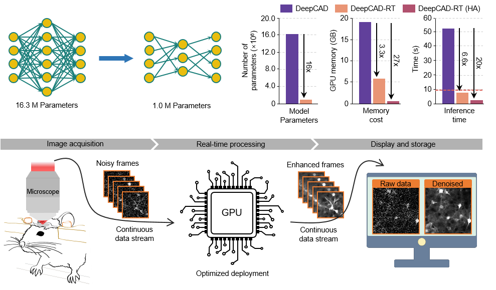
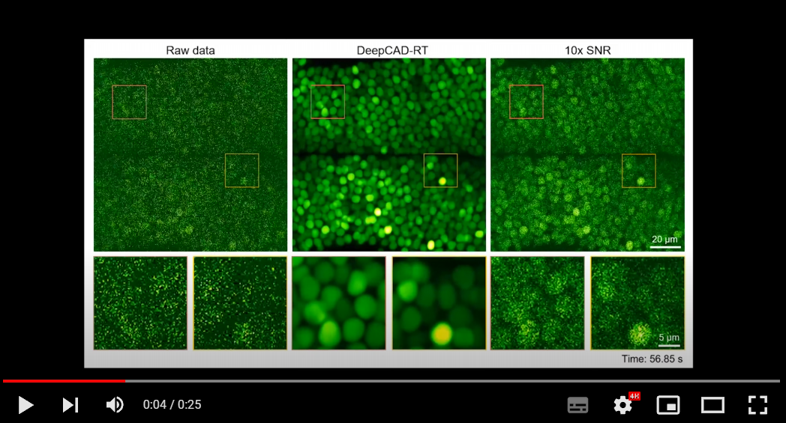
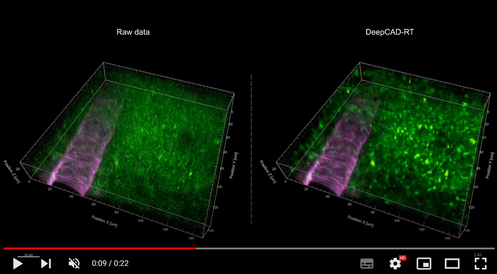
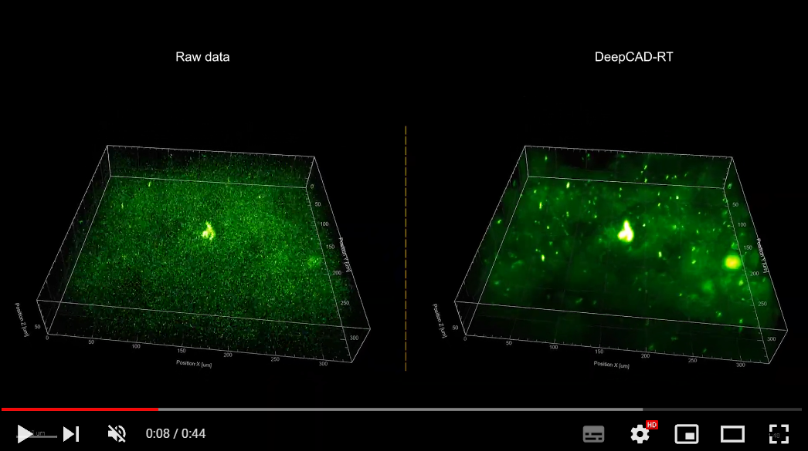

# DeepCAD-RT: Real-time denoising of fluorescence time-lapse imaging using deep self-supervised learning

<center></center>

### [Project page](https://cabooster.github.io/DeepCAD-RT/) | [Paper](https://www.biorxiv.org/content/10.1101/2022.03.14.484230v1)

## Contents

- [Overview](#overview)
- [Directory structure](#directory-structure)
- [Pytorch code](#pytorch-code)
- [Matlab GUI](#matlab-gui)
- [Results](#results)
- [License](./LICENSE)
- [Citation](#citation)

## Overview

**Among the challenges of fluorescence microscopy, poor imaging signal-to-noise ratio (SNR) caused by limited photon budget lingeringly stands in the central position.** Fluorescence microscopy is inherently sensitive to detection noise because the photon flux in fluorescence imaging is far lower than that in photography. For almost all fluorescence imaging technologies, the inherent [**shot-noise limit**](https://cabooster.github.io/DeepCAD-RT/About/) determines the upper bound of imaging SNR and restricts the imaging resolution, speed, and sensitivity. To capture enough fluorescence photons for satisfactory SNR, researchers have to sacrifice imaging resolution, speed, and even sample health.  

We present a versatile method **DeepCAD-RT** to denoise fluorescence time-lapse images with rapid processing speed that can be incorporated with the microscope acquisition system to achieve real-time denoising. Our method is based on deep self-supervised learning and the original low-SNR data can be directly used for training convolutional networks, making it particularly advantageous in functional imaging where the sample is undergoing fast dynamics and capturing ground-truth data is hard or impossible. We have demonstrated extensive experiments including calcium imaging in mice, zebrafish, and flies, cell migration observations, and the imaging of a new genetically encoded ATP sensor, covering both 2D single-plane imaging and 3D volumetric imaging. **Qualitative and quantitative evaluations show that our method can substantially enhance fluorescence time-lapse imaging data and permit high-sensitivity imaging of biological dynamics beyond the shot-noise limit.**


For more details, please see the companion paper where the method first appeared: 
["*Real-time denoising of fluorescence time-lapse imaging enables high-sensitivity observations of biological dynamics beyond the shot-noise limit, bioRxiv (2022)*"](https://www.biorxiv.org/content/10.1101/2022.03.14.484230v1).



## Directory structure

```
DeepCAD-RT
|---DeepCAD_RT_pytorch #Pytorch implementation of DeepCAD-RT#
|---|---demo_train_pipeline.py
|---|---demo_test_pipeline.py
|---|---convert_pth_to_onnx.py
|---|---deepcad
|---|---|---__init__.py
|---|---|---utils.py
|---|---|---network.py
|---|---|---model_3DUnet.py
|---|---|---data_process.py
|---|---|---buildingblocks.py
|---|---|---test_collection.py
|---|---|---train_collection.py
|---|---|---movie_display.py
|---|---notebooks
|---|---|---demo_train_pipeline.ipynb
|---|---|---demo_test_pipeline.ipynb
|---|---|---DeepCAD_RT_demo_colab.ipynb
|---|---datasets
|---|---|---DataForPytorch # project_name #
|---|---|---|---data.tif
|---|---pth
|---|---|---ModelForPytorch
|---|---|---|---model.pth
|---|---|---|---model.yaml
|---|---onnx
|---|---|---ModelForPytorch
|---|---|---|---model.onnx
|---|---results
|---|---|--- # test results#
|---DeepCAD_RT_GUI #Matlab GUI of DeepCAD-RT#
```
- **DeepCAD_RT_pytorch** contains the Pytorch implementation of DeepCAD-RT (Python scripts, Jupyter notebooks, Colab notebook)
- **DeepCAD_RT_GUI** contains all C++ and Matlab files for the real-time implementation of DeepCAD-RT

## Pytorch code

###  :triangular_flag_on_post:UPDATE v0.7 (June 2022) 

We replace 12-fold data augmentation with 16-fold data augmentation for more stable results. 

Denoising performance (SNR) comparison with the increase of training epochs on simulated  calcium imaging data:
<center></center>

### Our environment 

* Ubuntu 16.04 
* Python 3.6
* Pytorch 1.8.0
* NVIDIA GPU (GeForce RTX 3090) + CUDA (11.1)

### Environment configuration

1. Create a virtual environment and install PyTorch. In the 3rd step, please select the correct Pytorch version that matches your CUDA version from [https://pytorch.org/get-started/previous-versions/](https://pytorch.org/get-started/previous-versions/). 

   ```
   $ conda create -n deepcadrt python=3.6
   $ conda activate deepcadrt
   $ pip install torch==1.8.0+cu111 torchvision==0.9.0+cu111 torchaudio==0.8.0 -f https://download.pytorch.org/whl/torch_stable.html
   ```
      
      *Note:  `pip install` command is required for Pytorch installation.*
  
2. We made a installable pip release of DeepCAD-RT [[pypi](https://pypi.org/project/deepcad/)]. You can install it by entering the following command:

   ```
   $ pip install deepcad
   ```

### Download the source code

```
$ git clone https://github.com/cabooster/DeepCAD-RT
$ cd DeepCAD-RT/DeepCAD_RT_pytorch/
```

### Demos

To try out the Python code, please activate the `deepcadrt` environment first:

```
$ source activate deepcadrt
$ cd DeepCAD-RT/DeepCAD_RT_pytorch/
```

**Example training**

To train a DeepCAD-RT model, we recommend starting with the demo script `demo_train_pipeline.py`. One demo dataset will be downloaded to the `DeepCAD_RT_pytorch/datasets` folder automatically. You can also download other data from [the companion webpage](https://cabooster.github.io/DeepCAD-RT/Datasets/) or use your own data by changing the training parameter `datasets_path`. 

```
python demo_train_pipeline.py
```

**Example testing**

To test the denoising performance with pre-trained models, you can run the demo script `demo_test_pipeline.py` . A demo dataset and its denoising model will be automatically downloaded to `DeepCAD_RT_pytorch/datasets` and `DeepCAD_RT_pytorch/pth`, respectively. You can change the dataset and the model by changing the parameters `datasets_path` and `denoise_model`.

```
python demo_test_pipeline.py
```

### Jupyter notebook

We provide simple and user-friendly Jupyter notebooks to implement DeepCAD-RT. They are in the `DeepCAD_RT_pytorch/notebooks` folder. Before you launch the notebooks, please configure an environment following the instruction in [Environment configuration](#environment-configuration) . And then, you can launch the notebooks through the following commands:

```
$ source activate deepcadrt
$ cd DeepCAD-RT/DeepCAD_RT_pytorch/notebooks
$ jupyter notebook
```

<center></center> 

### Colab notebook

We also provide a cloud-based notebook implemented with Google Colab. You can run DeepCAD-RT directly in your browser using a cloud GPU without configuring the environment. 

[](https://colab.research.google.com/github/cabooster/DeepCAD-RT/blob/main/DeepCAD_RT_pytorch/notebooks/DeepCAD_RT_demo_colab.ipynb)

*Note: The Colab notebook needs much longer time to train and test because of the limited GPU performance offered by Colab.*

<center></center> 

## Matlab GUI

To achieve real-time denoising, DeepCAD-RT was optimally deployed on GPU using TensorRT (Nvidia) for further acceleration and memory reduction. We also designed a sophisticated time schedule for multi-thread processing. Based on a two-photon microscope, real-time denoising has been achieved with our Matlab GUI of DeepCAD-RT (tested on a Windows desktop with Intel i9 CPU and 128 GB RAM).  **Tutorials** on installing and using the GUI has been moved to [**this page**](https://github.com/cabooster/DeepCAD-RT/tree/main/DeepCAD_RT_GUI).  

<center></center> 

## Results

### 1. DeepCAD-RT massively improves the imaging SNR of neuronal population recordings in the zebrafish brain.

[]( https://www.youtube.com/embed/GN0IO7bGoGg "Video Title")

### 2. Denoising performance of DeepCAD-RT of neutrophils in the mouse brain in vivo.

[]( https://www.youtube.com/embed/eyLPVRcEGHs "Video Title")

### 3. DeepCAD-RT reveals the ATP (Adenosine 5’-triphosphate) dynamics of astrocytes in 3D after laser-induced brain injury.

[](https://www.youtube.com/embed/u1ejSaVvWiY "Video Title")

More demo videos are presented on [our website](https://cabooster.github.io/DeepCAD-RT/Gallery/).

## Citation

If you use this code please cite the companion paper where the original method appeared: 

- Xinyang Li, Yixin Li, Yiliang Zhou, et al. Real-time denoising of fluorescence time-lapse imaging enables high-sensitivity observations of biological dynamics beyond the shot-noise limit. bioRxiv (2022). [https://doi.org/10.1101/2022.03.14.484230](https://www.biorxiv.org/content/10.1101/2022.03.14.484230v1)

- Xinyang Li, Guoxun Zhang, Jiamin Wu, et al. Reinforcing neuron extraction and spike inference in calcium imaging using deep self-supervised denoising. Nat Methods 18, 1395–1400 (2021). [https://doi.org/10.1038/s41592-021-01225-0](https://www.nature.com/articles/s41592-021-01225-0) 


```
@article {Li2022.03.14.484230,
  author = {Li, Xinyang and Li, Yixin and Zhou, Yiliang and Wu, Jiamin and Zhao, Zhifeng and Fan, Jiaqi and Deng, Fei and Wu, Zhaofa and Xiao, Guihua and He, Jing and Zhang, Yuanlong and Zhang, Guoxun and Hu, Xiaowan and Zhang, Yi and Qiao, Hui and Xie, Hao and Li, Yulong and Wang, Haoqian and Fang, Lu and Dai, Qionghai},
  title = {Real-time denoising of fluorescence time-lapse imaging enables high-sensitivity observations of biological dynamics beyond the shot-noise limit},
  elocation-id = {2022.03.14.484230},
  year = {2022},
  doi = {10.1101/2022.03.14.484230},
  publisher = {Cold Spring Harbor Laboratory},
  URL = {https://www.biorxiv.org/content/early/2022/03/14/2022.03.14.484230},
  eprint = {https://www.biorxiv.org/content/early/2022/03/14/2022.03.14.484230.full.pdf},
  journal = {bioRxiv}
}
@article{li2021reinforcing,
  title={Reinforcing neuron extraction and spike inference in calcium imaging using deep self-supervised denoising},
  author={Li, Xinyang and Zhang, Guoxun and Wu, Jiamin and Zhang, Yuanlong and Zhao, Zhifeng and Lin, Xing and Qiao, Hui and Xie, Hao and Wang, Haoqian and Fang, Lu and others},
  journal={Nature Methods},
  volume={18},
  number={11},
  pages={1395--1400},
  year={2021},
  publisher={Nature Publishing Group}
}
```
